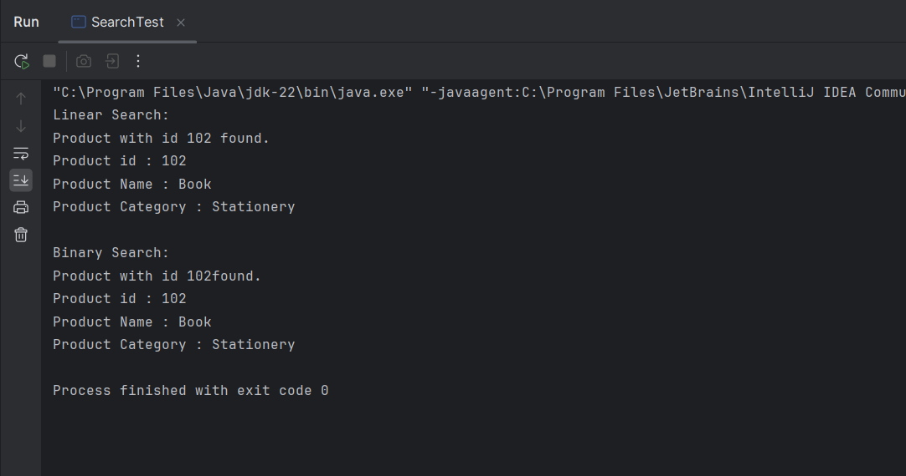

# E-commerce Platform Search

## Description
Search for products by ID using linear and binary search.

## How to Run
Run `SearchTest.java`.

## Output

## Analysis
- **Linear Search** time complexity: O(n)
- **Binary Search** time complexity: O(log n)

Binary search is more efficient and suitable when the product list is sorted. Linear search is simpler but slower for large datasets.
