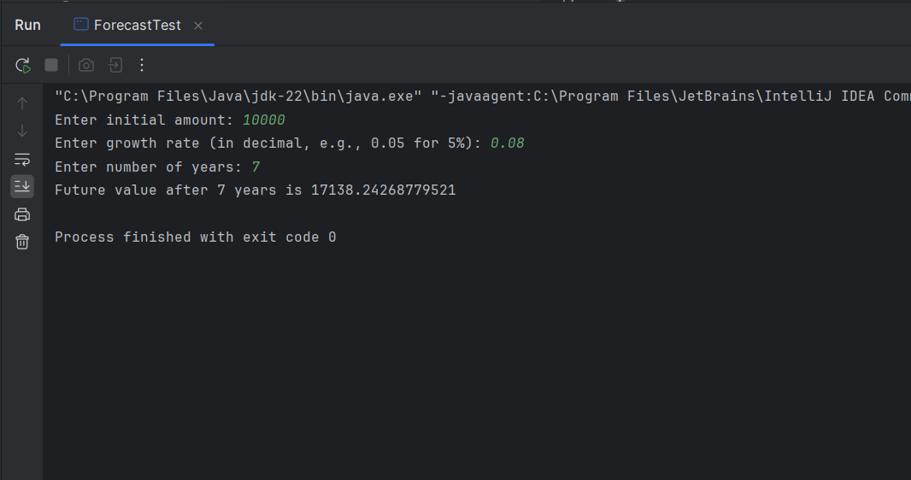

# Financial Forecasting using Recursion

## Description
This program calculates future value using recursion based on initial amount and growth rate.

## How to Run
Run `ForecastTest.java`.

## Output

## Analysis
- **Time complexity** of recursive function: O(n)
- The recursive approach may lead to repeated calculations for large `n`.
- It can be optimized using memoization or converting it to an iterative solution to avoid excessive computation.
