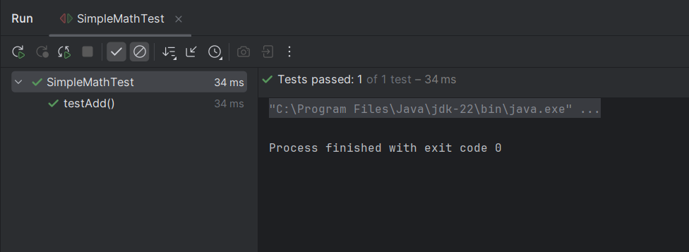

# Exercise 1: Setting Up JUnit

This exercise demonstrates the basic setup for using JUnit in a Java Maven project.

## Summary

- The project is configured with JUnit 5 using Maven.
- A basic test class is created to confirm the test setup is working.

## Files

- 🔗 [SimpleMath.java](./src/main/java/SimpleMath.java)
- 🔗 [SimpleMathTest.java](./src/test/java/SimpleMathTest.java)
- 🖼️ [output.png](./output.png)

## Output:
- 
