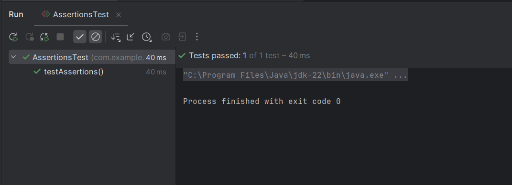

# Exercise 3: Assertions in JUnit

This exercise demonstrates the use of various assertions provided by JUnit 5.

## Summary

- `assertEquals`, `assertTrue`, `assertFalse`, `assertNull`, and `assertNotNull` are used to validate different types of test conditions.

## Files
- 🔗 [AssertionsTest.java](./src/test/java/com/example/junit/AssertionsTest.java)
- 🖼️ [output.png](./output.png)

## Output:
- 
