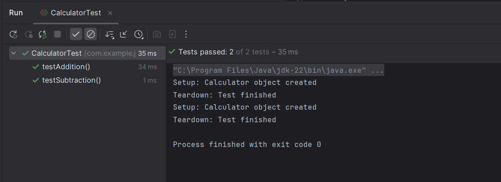

# Exercise 4: AAA Pattern, Setup and Teardown in JUnit

This exercise uses the Arrange-Act-Assert (AAA) pattern and demonstrates setup and teardown using JUnit annotations.

## Summary

- `@BeforeEach` and `@AfterEach` are used to prepare and clean up before/after tests.
- A simple `Calculator` class is tested using `add()` and `subtract()` methods.

## Files
- 🔗 [Calculator.java](./src/main/java/com/example/junit/Calculator.java)
- 🔗 [CalculatorTest.java](./src/test/java/com/example/junit/CalculatorTest.java)
- 🖼️ [output.png](./output.png)

## Output:
- 
