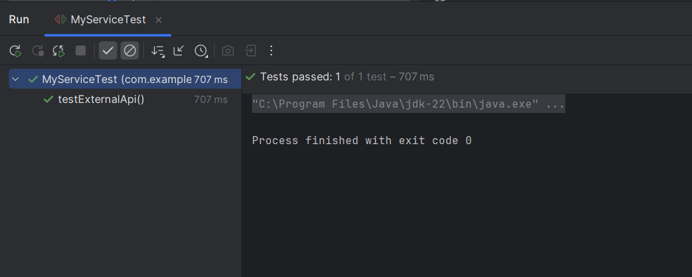

# Exercise 1: Mocking and Stubbing with Mockito

This exercise demonstrates mocking an external API using Mockito and returning stubbed values.

## Summary

- `Mockito.mock()` is used to create a mock of the `ExternalApi`.
- The `when(...).thenReturn(...)` pattern is used to stub responses.

## Files
- 🔗 [ExternalApi.java](./src/main/java/com/example/mockito/ExternalApi.java)
- 🔗 [MyService.java](./src/main/java/com/example/mockito/MyService.java)
- 🔗 [MyServiceTest.java](./src/test/java/com/example/mockito/MyServiceTest.java)
- 🖼️ [output.png](./output.png)

## Output:
- 
