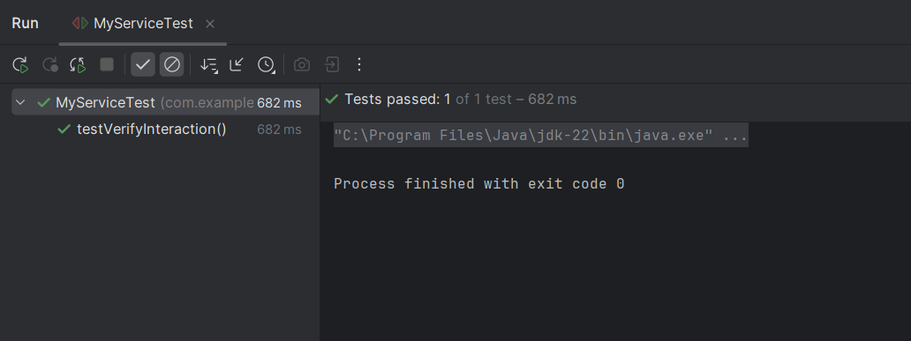

# Exercise 2: Verifying Interactions with Mockito

This exercise shows how to verify that specific method calls happened on a mock object.

## Summary

- `verify(mock).method()` is used to ensure expected interactions occurred during the test.

## Files
- 🔗 [ExternalApi.java](./src/main/java/com/example/mockito/mockito/ExternalApi.java)
- 🔗 [MyService.java](./src/main/java/com/example/mockito/mockito/MyService.java)
- 🔗 [MyServiceTest.java](./src/test/java/com/example/mockito/MyServiceTest.java)
- 🖼️ [output.png](./output.png)

## Output:
- 
