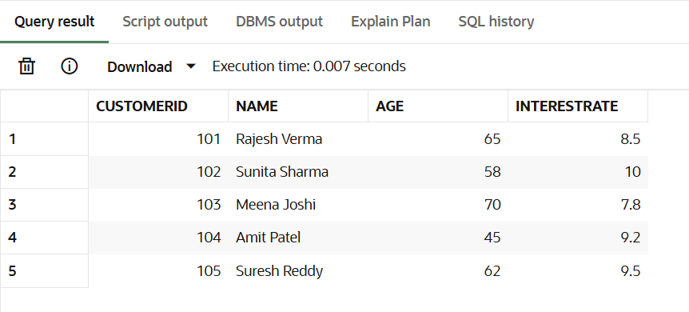
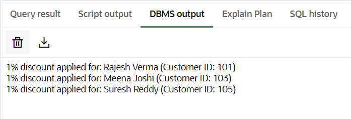
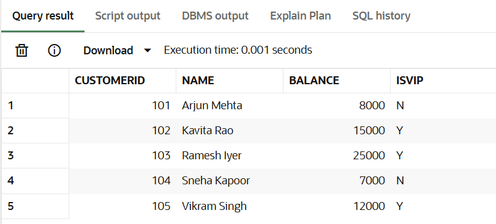
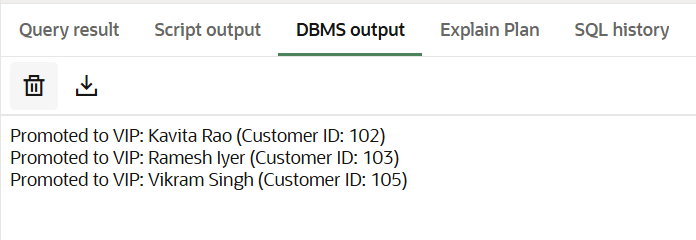
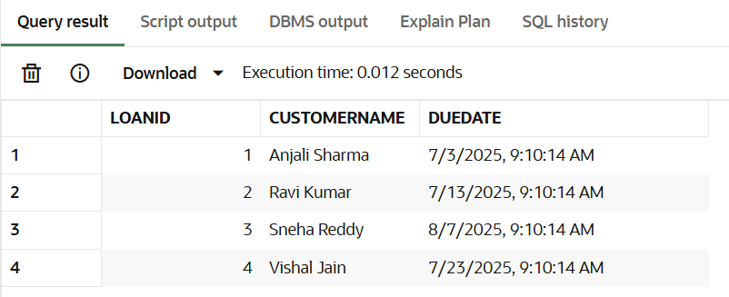
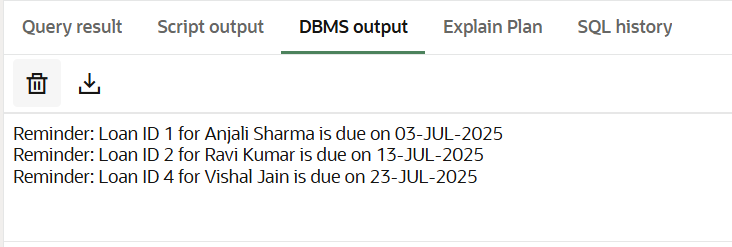

# Exercise 1: Control Structures – PL/SQL

This folder contains three PL/SQL programs demonstrating loops and conditional structures in banking use cases.

---

### 1. Apply Interest Rate Discount to Senior Citizens

Customers above age 60 get a 1% interest rate discount.

🔗 [scenario1_discount_for_seniors.sql](./scenario1_discount_for_seniors.sql)

#### 📊 Senior Customer Table:

#### 🖥️ DBMS Output:

---

### 2. Promote VIP Customers

Customers with a balance > ₹10,000 are marked as VIP (`IsVIP = 'Y'`).

🔗 [scenario2_vip_customers.sql](./scenario2_vip_customers.sql)

#### 📊 VIP Customer Table:

#### 🖥️ DBMS Output:

---

### 3. Send Loan Reminders

Displays reminders for loans due within 30 days.

🔗 [scenario3_loan_reminders.sql](./scenario3_loan_reminders.sql)

#### 📊 Loan Customers Table:

#### 🖥️ DBMS Output:

