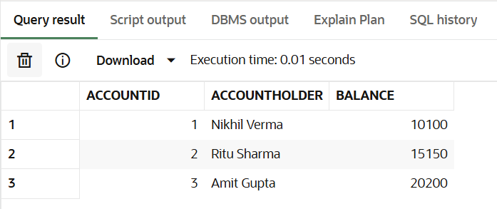
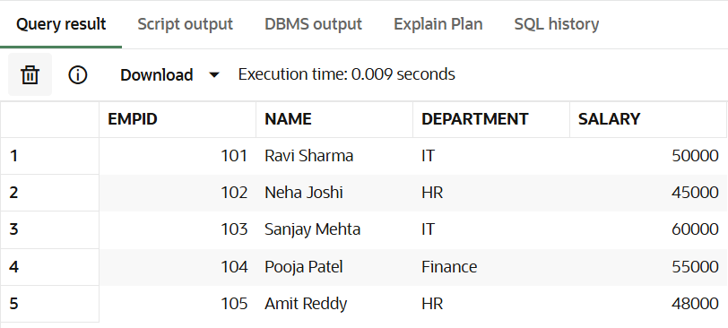
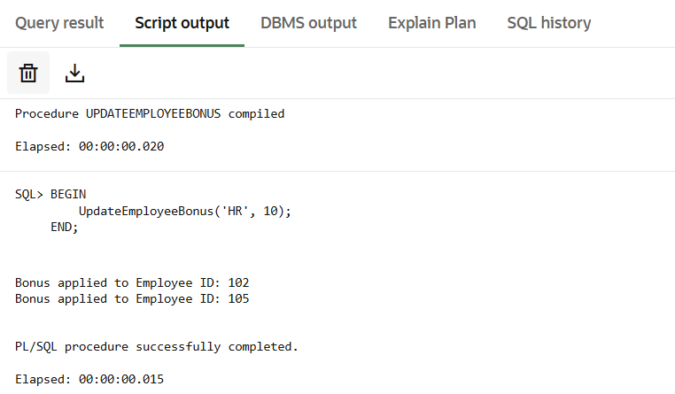
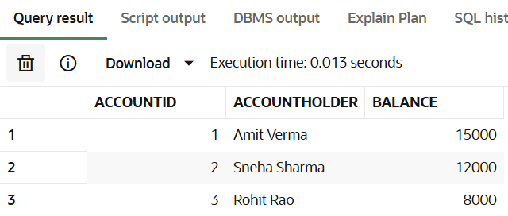
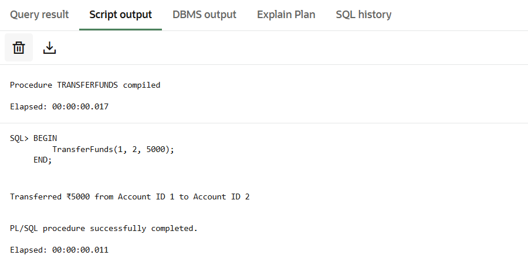

# Exercise 3: Stored Procedures – PL/SQL

This folder includes stored procedures to perform typical banking tasks such as applying interest, bonuses, and fund transfers.

---

### 1. Process Monthly Interest

Adds 1% interest to all savings accounts.

🔗 [scenario1_process_monthly_interest.sql](./scenario1_process_monthly_interest.sql)

#### 📊 Savings Accounts Table:

#### 🖥️ DBMS Output:

---

### 2. Update Employee Bonus

Increases salary of all employees in a department by a given bonus %.

🔗 [scenario2_employee_bonus.sql](./scenario2_employee_bonus.sql)

#### 📊 Employees Table:

#### 🖥️ DBMS Output:

---

### 3. Transfer Funds Between Accounts

Transfers amount between accounts only if the source has sufficient balance.

🔗 [scenario3_transfer_funds.sql](./scenario3_transfer_funds.sql)

#### 📊 Bank Accounts Table:

#### 🖥️ DBMS Output:

