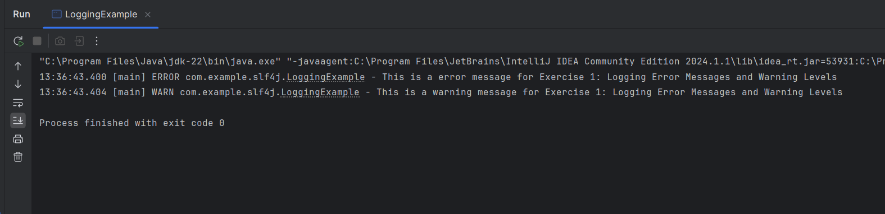

# Exercise 1: SLF4J Logging – Error and Warning Levels

This exercise demonstrates basic error and warning level logging using SLF4J with Logback.

## Summary

- Logs are generated using `logger.error()` and `logger.warn()`.
- Dependencies include `slf4j-api` and `logback-classic`.

## Files
- 🔗 [LoggingExample.java](./src/main/java/com/example/slf4j/LoggingExample.java)
- 🖼️ [output.png](./output.png)

## Output:
- 
